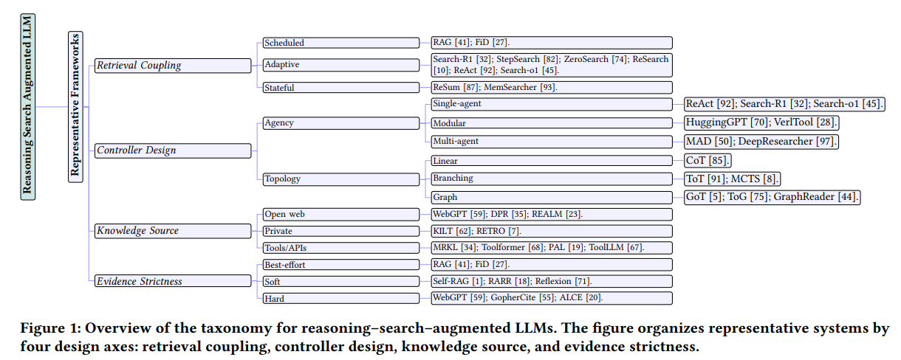
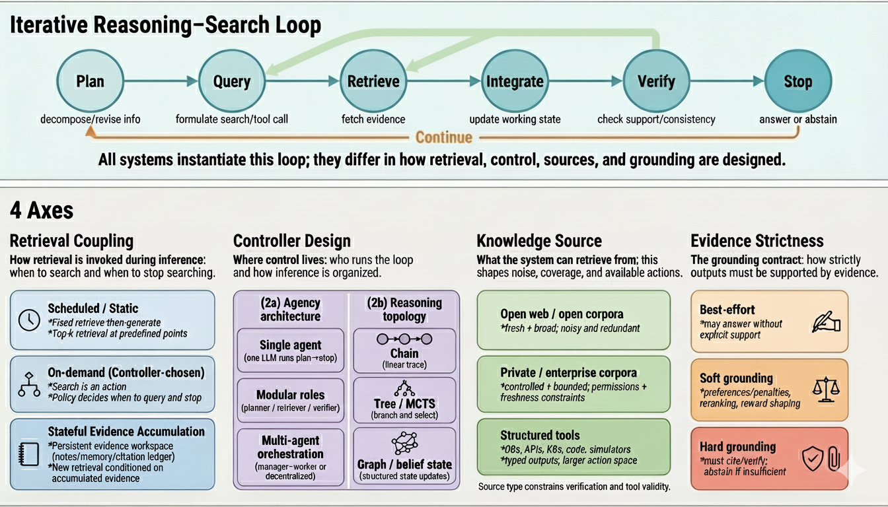
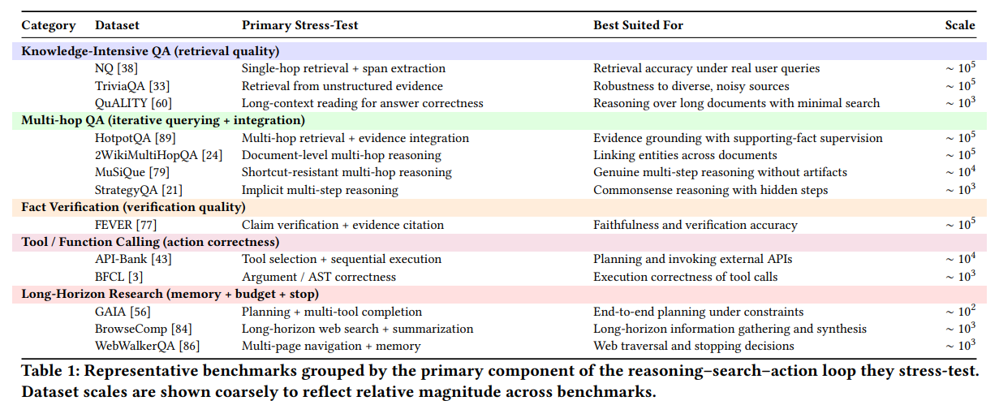

# Awesome-Reasoning-Search-Augmented-LLMs

[](https://awesome.re)
[](https://opensource.org/licenses/MIT)
[](http://makeapullrequest.com)

A curated list of **Reasoning-Search-Augmented Large Language Models (RSA-LLMs)** — systems that treat **search as an explicit action inside an iterative reasoning loop**, rather than a one-shot “retrieve-then-generate” pipeline.

This repository is the companion to our survey paper:

**_Reasoning-Search-Augmented Large Language Models: A Survey and Taxonomy_ (SemTech ’26)**
- **Authors:** Biswas Poudel*, Nilson Chapagain, Xianshun Jiang, Amit Kumar  
- **Resources:** this repo is referenced in the paper as the public resource hub

---

## What counts as an RSA-LLM?

We define RSA-LLMs as systems implementing the loop:  
**plan → query → retrieve → integrate → verify → stop**

They are distinguished from “vanilla” RAG by **conditional execution**: *the decision to search depends on the evolving reasoning state*, not a static retrieval step.

> **Scope note:** We primarily emphasize text-based knowledge access (open web, private corpora/KBs), and include tool-mediated retrieval/verification when it is coupled with evidence-seeking inside the loop.

---

## 🧩 Taxonomy (from the survey)

Our survey organizes RSA-LLMs using **four system-level axes**:  
1) **Retrieval Coupling** (how/when retrieval is invoked)  
2) **Controller Design** *(agency architecture + reasoning topology)*  
3) **Knowledge Source** (open web vs private vs tools/APIs/structured substrates)  
4) **Grounding Strictness** (best-effort vs soft vs hard contracts)

We treat the **learning signal** (**Prompting / SFT / RL**) as **orthogonal tags** that can apply to any point in this design space (i.e., not a primary taxonomy axis).

### Figures / Tables (repo assets)
- 
- 
- 

---

## ✅ Benchmarks & Evaluation (how papers are assessed)

Evaluating reasoning–search–action systems extends beyond answer accuracy to include:
- **Answer Quality** (EM/F1 or judge-based scores)
- **Grounding Quality** (supporting-fact F1, citation metrics)
- **Search Behaviour** (search steps, redundancy, latency/cost)
- **Tool Correctness** (tool-call success, argument/AST correctness)

Table 1 in the survey summarizes representative datasets spanning single-step retrieval → long-horizon, multi-tool reasoning, organized by which part of the loop they stress-test.

---

## Contents

### Taxonomy-first navigation (matches the survey)
- [Axis 1: Retrieval Coupling](#axis-1-retrieval-coupling)
- [Axis 2: Controller Design](#axis-2-controller-design)
- [Axis 3: Knowledge Source](#axis-3-knowledge-source)
- [Axis 4: Grounding Strictness](#axis-4-grounding-strictness)
- [Orthogonal Tags: Learning Signal](#orthogonal-tags-learning-signal)

---

## Axis 1: Retrieval Coupling

**Retrieval coupling** describes *when* the system searches, *what* it queries, and *when* it stops searching. 
Common regimes (as used in the survey’s overview figure): **Scheduled**, **Adaptive**, **Stateful**.

## Axis 2: Controller Design

Controller design specifies **where control lives** and **how inference is organized**, decomposed as:
- **Agency architecture:** single-agent vs modular vs multi-agent
- **Reasoning topology:** linear vs branching vs graph

## Axis 3: Knowledge Source

Knowledge sources include **open web**, **private corpora/KBs**, and **tools/APIs / structured substrates (e.g., KGs)**.

## Axis 4: Grounding Strictness

Grounding strictness ranges from:
- **Best-effort** (no strict contract),
- **Soft** (self-critique / revise / heuristics),
- **Hard** (must-ground / cite / abstain if insufficient evidence).

## Orthogonal Tags: Learning Signal

We tag systems by the **learning signal** used to instantiate the loop behavior:
- **Prompting**, **SFT**, **RL** (orthogonal to the four axes).

> Planned: add compact tags to each paper like  
> `[Coupling: Adaptive] [Agency: Single] [Topology: Linear] [Source: OpenWeb] [Grounding: Soft] [Signal: RL]`

---


## 📚 Paper List

### Axis 1: Retrieval Coupling
<h3 id="Scheduled">Scheduled/Static Coupling</h3>

- **(RAG)** Retrieval-Augmented Generation for Knowledge-Intensive NLP Tasks ```NeurIPS 2022```     
[[Paper](https://proceedings.neurips.cc/paper/2020/file/6b493230205f780e1bc26945df7481e5-Paper.pdf)]

- **(FiD)** Leveraging Passage Retrieval with Generative Models for Open Domain Question Answering ```EACL 2021 ```
[[Paper](https://aclanthology.org/2021.eacl-main.74.pdf)]

<h3 id="Adaptive">Adaptive Coupling via on-demand controller</h3>

- **(Search-R1)** Search-R1: Training LLMs to Reason and Leverage Search Engines with Reinforcement Learning ```COLM 2025```
[[Paper](https://arxiv.org/abs/2503.09516)] [[Github](https://github.com/PeterGriffinJin/Search-R1)] [[Models](https://huggingface.co/collections/PeterJinGo/search-r1)]

- **(StepSearch)** StepSearch: Igniting LLMs Search Ability via Step-Wise Proximal Policy Optimization ```EMNLP 2025```     
[[Paper](https://arxiv.org/abs/2505.15107)] [[GitHub](https://github.com/Zillwang/StepSearch)] [[Model (3B Base)](https://huggingface.co/Zill1/StepSearch-3B-Base/tree/main)] [[Model (7B Base)](https://huggingface.co/Zill1/StepSearch-7B-Base/tree/main)] [[Model (3B Instruct)](https://huggingface.co/Zill1/StepSearch-3B-Instruct/tree/main)] [[Model (7B Instruct)](https://huggingface.co/Zill1/StepSearch-7B-Instruct/tree/main)] [[Dataset](https://huggingface.co/datasets/Zill1/StepSearch-musi-dataset)]

- **(ZeroSearch)** ZeroSearch: Incentivize the Search Capability of LLMs without Searching ```arXiv 2025```     
[[Paper](https://arxiv.org/abs/2505.04588)] [[GitHub](https://github.com/Alibaba-NLP/ZeroSearch)] [[Models](https://huggingface.co/collections/sunhaonlp/zerosearch-policy-google-v1)]

- **(ReSearch)** ReSearch: Learning to Reason with Search for LLMs via Reinforcement Learning ```NeurIPS 2025```     
[[Paper](https://arxiv.org/abs/2503.19470)] [[GitHub](https://github.com/Agent-RL/ReCall)] [[Models](https://huggingface.co/collections/agentrl/research)]

- **(ReAct)** ReAct: Synergizing Reasoning and Acting in Language Models ```ICLR 2023```
[[Paper](https://openreview.net/pdf?id=WE_vluYUL-X)] [[GitHub](https://react-lm.github.io/)]

- **(Search-o1)** Search-o1: Agentic Search-Enhanced Large Reasoning Models ```EMNLP 2025 (Oral)```     
[[Paper](https://arxiv.org/abs/2501.05366)] [[GitHub](https://github.com/RUC-NLPIR/Search-o1)] [[Project](https://search-o1.github.io/)]

<h3 id="Stateful">Stateful evidence accumulation</h3>

- **(ReSum)** ReSum: Unlocking Long-Horizon Search Intelligence via Context Summarization ```arXiv 2025```     
[[Paper](https://arxiv.org/abs/2509.13313)] [[GitHub](https://github.com/Alibaba-NLP/DeepResearch)] [[Model (30B)](https://huggingface.co/Alibaba-NLP/Tongyi-DeepResearch-30B-A3B)] [[Blog](https://tongyi-agent.github.io/blog/introducing-tongyi-deep-research/)]

- **(MemSearcher)** MemSearcher: Training LLMs to Reason, Search and Manage Memory via End-to-End Reinforcement Learning ```arXiv 2025```     
[[Paper](https://arxiv.org/abs/2511.02805)] [[GitHub](https://github.com/icip-cas/MemSearcher)] 

### Axis 2: Controller Design
<h3 id="Agency">Agency Architecture (Who runs the loop)</h3>
<h4 id="Single-Agent"></h4>h4>

- **(ReAct)** ReAct: Synergizing Reasoning and Acting in Language Models ```ICLR 2023```
[[Paper](https://openreview.net/pdf?id=WE_vluYUL-X)] [[GitHub](https://react-lm.github.io/)]

- **(Search-R1)** Search-R1: Training LLMs to Reason and Leverage Search Engines with Reinforcement Learning ```COLM 2025```
[[Paper](https://arxiv.org/abs/2503.09516)] [[Github](https://github.com/PeterGriffinJin/Search-R1)] [[Models](https://huggingface.co/collections/PeterJinGo/search-r1)]

- **(Search-o1)** Search-o1: Agentic Search-Enhanced Large Reasoning Models ```EMNLP 2025 (Oral)```     
[[Paper](https://arxiv.org/abs/2501.05366)] [[GitHub](https://github.com/RUC-NLPIR/Search-o1)] [[GitHub](https://search-o1.github.io/)]

<h4 id="Modular">Modular</h4>h4>

- **(HuggingGPT)** HuggingGPT: Solving AI Tasks with ChatGPT and its Friends in Hugging Face ```NeurIPS 2023```
[[Paper]](https://proceedings.neurips.cc/paper_files/paper/2023/file/77c33e6a367922d003ff102ffb92b658-Paper-Conference.pdf)] [[GitHub](https://github.com/microsoft/JARVIS)]

- **(VerlTool)** VerlTool: Towards Holistic Agentic Reinforcement Learning with Tool Use ```arXiv 2025```
[[Paper](https://arxiv.org/abs/2509.01055)] [[GitHub](https://github.com/TIGER-AI-Lab/verl-tool)]

<h4 id="Multi-Agent">Multi-Agent</h4>h4>

- **(MAD)** Encouraging Divergent Thinking in Large Language Models through Multi-Agent Debate ```EMNLP 2024```
[[Paper](https://aclanthology.org/2024.emnlp-main.992.pdf)] [[GitHub](https://github.com/Skytliang/Multi-Agents-Debate)

- **(DeepResearcher)** DeepResearcher: Scaling Deep Research via Reinforcement Learning in Real-world Environments ```EMNLP 2025```
[[Paper](https://arxiv.org/abs/2504.03160)] [[GitHub](https://github.com/GAIR-NLP/DeepResearcher)]

<h3 id="Topology">Reasoning Topology (how inference is structured)</h3>
<h4 id="Linear">Linear</h4>

- **(CoT)** Chain-of-Thought Prompting Elicits Reasoning in Large Language Models ```NeurIPS 2022```
[[Paper](https://proceedings.neurips.cc/paper_files/paper/2022/file/9d5609613524ecf4f15af0f7b31abca4-Paper-Conference.pdf)]

<h4 id="Branching">Branching</h4>

- **(ToT)** Tree of Thoughts: Deliberate Problem Solving with Large Language ModelS ```NeurIPS 2023```
[[Paper](https://proceedings.neurips.cc/paper_files/paper/2023/file/271db9922b8d1f4dd7aaef84ed5ac703-Paper-Conference.pdf)] [[GitHub](https://github.com/princeton-nlp/tree-of-thought-llm)]

- **(MCTS)** A Survey of Monte Carlo Tree Search Methods ```IEEE 2012```
[[Paper](https://repository.essex.ac.uk/4117/1/MCTS-Survey.pdf)] 

<h4 id="Graph">Graph</h4>

- **(GoT)** Graph of Thoughts: Solving Elaborate Problems with Large Language Models ```AAAI 2024```
[[Paper](https://ojs.aaai.org/index.php/AAAI/article/view/29720/31236)] [[GitHub](https://github.com/spcl/graph-of-thoughts)]

- **(ToG)** Think-on-Graph: Deep and Responsible Reasoning of Large Language Models on Knowledge Graphs ```ICLR 2024```
[[Paper](https://arxiv.org/abs/2307.07697)] [[GitHub](https://github.com/DataArcTech/ToG)]

- **(GraphReader)** GraphReader: Building Graphbased Agent to Enhance Long-Context Abilities of Large Language Models ```arXiv 2024```
[[Paper](https://arxiv.org/abs/2406.14550)]

### Axis 3: Knowledge Source
<h3 id="Open Web">Open-world unstructured sources</h3>

- **(WebGPT)** WebGPT: Browser-assisted question-answering with human feedback ```arXiv 2022```
[[Paper](https://arxiv.org/abs/2112.09332)]

- **(DPR)**  Dense Passage Retrieval for OpenDomain Question Answering ```EMNLP 2020```
[[Paper](https://arxiv.org/pdf/2004.04906v2/1000)] [[Project](https://fburl.com/qa-dpr)]

- **(REALM)** REALM: Retrieval-Augmented Language Model Pre-Training ```ICML 2020```
[[Paper](https://proceedings.mlr.press/v119/guu20a.html?ref=http://githubhelp.com)]

<h3 id="Private">Private collections</h3>

- **(KILT)** KILT: A Benchmark for Knowledge-Intensive Language Tasks ```NAACL-HLT 2021```
[[Paper](https://aclanthology.org/2021.naacl-main.200/)] [[GitHub](https://github.com/facebookresearch/KILT)]

- **(RETRO)**  Improving Language Models by Retrieving from Trillions of Tokens ```ICML 2022```
[[Paper](https://proceedings.mlr.press/v162/borgeaud22a/borgeaud22a.pdf)]

<h3 id="Structured">Structured environments (tools, DBs, APIs, KBs, simulators)</h3>

- **(MRKL)** MRKL Systems: A Modular, Neuro-Symbolic Architecture that Combines Large Language Models, External Knowledge Sources and
Discrete Reasoning ```arXiv 2022```
[[Paper](https://arxiv.org/abs/2205.00445)]

- **(Toolformer)** Toolformer: Language Models Can Teach Themselves to Use Tools ```NeurIPS 2023```
[[Paper](https://proceedings.neurips.cc/paper_files/paper/2023/file/d842425e4bf79ba039352da0f658a906-Paper-Conference.pdf)]

- **(PAL)** PAL: Program-Aided Language Models ```ICML 2022```
[[Paper](https://proceedings.mlr.press/v202/gao23f/gao23f.pdf)] [[Project](https://reasonwithpal.com/)]

- **(ToolLLM)** ToolLLM: Facilitating Large Language Models to Master 16000+ Real-world APIs ```arXiv 2023```
[[Paper](https://arxiv.org/abs/2307.16789)] [[GitHub](https://github.com/OpenBMB/ToolBench)]

### Axis 4: Evidence Strictness
<h3 id="Best-effort">Best-effort (no explicit contract)</h3>

- **(RAG)** Retrieval-Augmented Generation for Knowledge-Intensive NLP Tasks ```NeurIPS 2022```     
[[Paper](https://proceedings.neurips.cc/paper/2020/file/6b493230205f780e1bc26945df7481e5-Paper.pdf)]

- **(FiD)** Leveraging Passage Retrieval with Generative Models for Open Domain Question Answering ```EACL 2021 ```
[[Paper](https://aclanthology.org/2021.eacl-main.74.pdf)]

<h3 id="soft">Soft grounding (preferences/penalties)</h3>

- **(Self-RAG)** Self-RAG: Learning to Retrieve, Generate, and Critique through Self-Reflection ```ICLR 2024```
[[Paper](https://par.nsf.gov/servlets/purl/10539591)] [[GitHub](https://selfrag.github.io/)]

- **(RARR)** RARR: Researching and Revising What Language Models Say, Using Language Models ```ACL 2023```
[[Paper](https://aclanthology.org/2023.acl-long.910.pdf)] [[GitHub](https://github.com/anthonywchen/RARR)]

- **(Reflexion)** Reflexion: Language Agents with Verbal Reinforcement Learning ```NeurIPS 2023```
[[Paper](https://proceedings.neurips.cc/paper_files/paper/2023/file/1b44b878bb782e6954cd888628510e90-Paper-Conference.pdf)] [[GitHub](https://github.com/noahshinn/reflexion)]

<h3 id="hard">Hard grounding (must-cite/abstain)</h3>

- **(WebGPT)** WebGPT: Browser-assisted question-answering with human feedback ```arXiv 2022```
[[Paper](https://arxiv.org/abs/2112.09332)]

- **(GopherCite)** Teaching language models to support answers with verified quotes ```arXiv 2022```
[[Paper](https://arxiv.org/abs/2203.11147)]

- **(ALCE)** Enabling Large Language Models to Generate Text with Citations ```EMNLP 2023```
[[Paper](https://aclanthology.org/anthology-files/anthology-files/pdf/emnlp/2023.emnlp-main.398.pdf)] [[GitHub](https://github.com/princeton-nlp/ALCE)]

---

## Contributing

PRs are welcome! Please include:
1) Paper title + authors  
2) Venue/date (use arXiv date if applicable; otherwise proceedings date)  
3) Links to PDF and code (if available)  
4) (Optional) Taxonomy tags: Retrieval coupling / Controller design / Knowledge source / Grounding strictness

Contact: **bpoudel@tamu.edu**, **xianshun@tamu.edu**


<!--
%%%%%%%%%%%%%%%%%%%% Previous version %%%%%%%%%%%%%%%%%%

- **(ZeroSearch)** ZeroSearch: Incentivize the Search Capability of LLMs without Searching ```arXiv 2025```     
[[Paper](https://arxiv.org/abs/2505.04588)] [[GitHub](https://github.com/Alibaba-NLP/ZeroSearch)] [[Models](https://huggingface.co/collections/sunhaonlp/zerosearch-policy-google-v1)]

- **(Stratified GRPO)** Stratified GRPO: Handling Structural Heterogeneity in Reinforcement Learning of LLM Search Agents ```arXiv 2025```     
[[Paper](https://arxiv.org/abs/2510.06214)] 

- **(AI-SearchPlanner)** AI-SearchPlanner: Modular Agentic Search via Pareto-Optimal Multi-Objective Reinforcement Learning ```ICLR 2026 UnderReview```     
[[Paper](https://arxiv.org/abs/2508.20368)] 

- **(O2-Searcher)** O2-Searcher: A Searching-based Agent Model for Open-Domain Open-Ended Question Answering ```arXiv 2025```     
[[Paper](https://arxiv.org/abs/2505.16582)] [[GitHub](https://github.com/KnowledgeXLab/O2-Searcher)] [[Model (3B)](https://huggingface.co/Jianbiao/O2-Searcher-Qwen2.5-3B-GRPO)] [[Dataset](https://huggingface.co/datasets/PeterJinGo/nq_hotpotqa_train/tree/main)]

- **(R-Search)**  R-Search: Empowering LLM Reasoning with Search via Multi-Reward Reinforcement Learning ```arXiv 2025```     
[[Paper](https://arxiv.org/abs/2506.04185)] [[GitHub](https://github.com/QingFei1/R-Search)] [[Models](https://huggingface.co/collections/qingfei1/r-search)] [[Dataset](https://huggingface.co/datasets/qingfei1/R-Search_datasets)]

- **(R3-RAG)** R3-RAG: Learning Step-by-Step Reasoning and Retrieval for LLMs via Reinforcement Learning ```arXiv 2025```     
[[Paper](https://arxiv.org/abs/2505.23794)] [[GitHub](https://github.com/Yuan-Li-FNLP/R3-RAG)] [[Model(Llama)](https://huggingface.co/Yuan-Li-FNLP/R3-RAG-Llama)] [[Model(Qwen)](https://huggingface.co/Yuan-Li-FNLP/R3-RAG-Qwen)] [[Dataset](https://huggingface.co/datasets/Yuan-Li-FNLP/R3-RAG-RLTrainingData)]

- **(Thinker)** Thinker: Training LLMs in Hierarchical Thinking for Deep Search via Multi-Turn Interaction
 ```AAAI 2026```     
[[Paper](https://arxiv.org/abs/2511.07943)] [[GitHub](https://github.com/OpenSPG/KAG-Thinker)] [[Model (7B)](https://huggingface.co/OpenSPG/KAG-Thinker-en-7b-instruct)] [[Dataset](https://huggingface.co/datasets/OpenSPG/KAG-Thinker-training-dataset)]


- **(R1-Searcher)** R1-Searcher: Incentivizing the Search Capability in LLMs via Reinforcement Learning ```arXiv 2025```     
[[Paper](https://arxiv.org/abs/2503.05592)] [[GitHub](https://github.com/RUCAIBox/R1-Searcher)] [[Model (Qwen)]( https://huggingface.co/XXsongLALA/Qwen-2.5-7B-base-RAG-RL)] [[Model (Llama)](https://huggingface.co/XXsongLALA/Llama-3.1-8B-instruct-RAG-RL)] [[Dataset](https://huggingface.co/datasets/XXsongLALA/RAG-RL-Hotpotqa-with-2wiki)]

- **(KunLunBaizeRAG)** KunLunBaizeRAG: Reinforcement Learning Driven Inference Performance Leap for Large Language Models ```arXiv 2025```     
[[Paper](https://arxiv.org/abs/2506.19466)] 

- **(RAG-R1)** RAG-R1: Incentivizing the Search and Reasoning Capabilities of LLMs through Multi-query Parallelism ```arXiv 2025```     
[[Paper](https://arxiv.org/abs/2507.02962)] [[GitHub](https://github.com/inclusionAI/AWorld-RL/tree/main/RAG-R1)] [[Models](https://huggingface.co/collections/endertzw/rag-r1)]


- **(SEM)** SEM: Reinforcement Learning for Search-Efficient Large Language Models ```arXiv 2025```     
[[Paper](https://arxiv.org/abs/2505.07903)] 

- **(s3)** s3: You Don't Need That Much Data to Train a Search Agent via RL ```EMNLP 2025```     
[[Paper](https://arxiv.org/abs/2505.14146)] [[GitHub](https://github.com/pat-jj/s3)] [[Dataset](https://huggingface.co/datasets/pat-jj/s3_processed_data)] 

- **(ToolRL)** ToolRL: Reward is All Tool Learning Needs ```NeurIPS 2025 poster```     
[[Paper](https://arxiv.org/abs/2504.13958)] [[GitHub](https://github.com/qiancheng0/ToolRL)] [[Models](https://huggingface.co/collections/emrecanacikgoz/toolrl)] [[Dataset](https://github.com/qiancheng0/ToolRL/tree/main/dataset)]

- **(InForage)** Scent of Knowledge: Optimizing Search-Enhanced Reasoning with Information Foraging ```NeurIPS 2025```     
[[Paper](https://arxiv.org/abs/2505.09316)] [[GitHub]()] [[Models]()]

- **(HRPO)** Hybrid Latent Reasoning via Reinforcement Learning ```NeurIPS 2025```     
[[Paper](https://arxiv.org/abs/2505.18454)] [[GitHub](https://github.com/Yueeeeeeee/HRPO)]


<h3 id="Multi‑Agent">Multi‑Agent / Modular RL Frameworks</h3>

- **(VerlTool)** VerlTool: Towards Holistic Agentic Reinforcement Learning with Tool Use ```arXiv 2025```     
[[Paper](https://arxiv.org/abs/2509.01055)] [[GitHub](https://github.com/TIGER-AI-Lab/verl-tool)] 

- **(MemSearcher)** MemSearcher: Training LLMs to Reason, Search and Manage Memory via End-to-End Reinforcement Learning ```arXiv 2025```     
[[Paper](https://arxiv.org/abs/2511.02805)] [[GitHub](https://github.com/icip-cas/MemSearcher)] 

- **(R1-Searcher)** R1-Searcher: Incentivizing the Search Capability in LLMs via Reinforcement Learning ```arXiv 2025```     
[[Paper](https://arxiv.org/abs/2503.05592)] [[GitHub](https://github.com/RUCAIBox/R1-Searcher)] 

- **(CoRAG)** Chain-of-Retrieval Augmented Generation ```NeurIPS 2025```     
[[Paper](https://arxiv.org/abs/2501.14342)] [[GitHub](https://github.com/microsoft/LMOps/tree/main/corag)] [[Model (8B)](https://huggingface.co/corag/CoRAG-Llama3.1-8B-MultihopQA)]

- **(DeepResearcher)** DeepResearcher: Scaling Deep Research via Reinforcement Learning in Real-world Environments ```EMNLP 2025```     
[[Paper](https://arxiv.org/abs/2504.03160)] [[GitHub](https://github.com/GAIR-NLP/DeepResearcher)] [[Model (7B)](https://huggingface.co/GAIR/DeepResearcher-7b)]

- **(SmartRAG)** SmartRAG: Jointly Learn RAG-Related Tasks From the Environment Feedback ```ICLR 2025```     
[[Paper](https://arxiv.org/abs/2410.18141)] [[GitHub](https://github.com/gaojingsheng/SmartRAG)] [[Model (7B)](https://github.com/AkariAsai/self-rag)]


<h3 id="Long-Horizon">Efficiency and Long‑Horizon RL</h3>

- **(ASearcher)** Beyond Ten Turns: Unlocking Long-Horizon Agentic Search with Large-Scale Asynchronous RL ```arXiv 2025```     
[[Paper](https://arxiv.org/abs/2508.07976)] [[GitHub](https://github.com/inclusionAI/ASearcher)] [[Models](https://huggingface.co/collections/inclusionAI/asearcher)] [[Dataset](https://huggingface.co/datasets/inclusionAI/ASearcher-train-data)]

- **(ReSum)** ReSum: Unlocking Long-Horizon Search Intelligence via Context Summarization ```arXiv 2025```     
[[Paper](https://arxiv.org/abs/2509.13313)] [[GitHub](https://github.com/Alibaba-NLP/DeepResearch)] [[Model (30B)](https://huggingface.co/Alibaba-NLP/Tongyi-DeepResearch-30B-A3B)] [[Blog](https://tongyi-agent.github.io/blog/introducing-tongyi-deep-research/)]

- **(SEM)** SEM: Reinforcement Learning for Search-Efficient Large Language Models ```arXiv 2025```     
[[Paper](https://arxiv.org/abs/2509.08827)] 

- **(s3)** s3: You Don't Need That Much Data to Train a Search Agent via RL ```EMNLP 2025```     
[[Paper](https://arxiv.org/abs/2505.14146)] [[GitHub](https://github.com/pat-jj/s3)] [[Dataset](https://huggingface.co/datasets/pat-jj/s3_processed_data)]

- **(MemSearcher)** MemSearcher: Training LLMs to Reason, Search and Manage Memory via End-to-End Reinforcement Learning ```arXiv 2025```     
[[Paper](https://arxiv.org/abs/2511.02805)] [[GitHub](https://github.com/icip-cas/MemSearcher)] 

### Prompt-Based and Supervised Search Agents


- **(AutoRefine)** Search and Refine During Think: Facilitating Knowledge Refinement for Improved Retrieval-Augmented Reasoning ```NeurIPS 2025 (Poster)```     
[[Paper](https://arxiv.org/abs/2505.11277)] [[GitHub](https://github.com/syr-cn/AutoRefine)] [[Model (3B)](https://huggingface.co/yrshi/AutoRefine-Qwen2.5-3B-Base)]

- **(DualRAG)** DualRAG: A Dual-Process Approach to Integrate Reasoning and Retrieval for Multi-Hop Question Answering ```ACL 2025```     
[[Paper](https://arxiv.org/abs/2504.18243)] [[GitHub](https://github.com/cbxgss/rag)] 

- **(PAR-RAG)** Credible Plan-Driven RAG Method for Multi-Hop Question Answering ```arXiv 2025```     
[[Paper](https://arxiv.org/abs/2504.16787)] 


### Tree-Search and Hierarchical Planning Approaches
- **(THOUGHTSCULPT)** THOUGHTSCULPT: Reasoning with Intermediate Revision and Search ```NAACL 2025```     
[[Paper](https://arxiv.org/abs/2404.05966)] [[GitHub](https://github.com/cyzus/thoughtsculpt)]

- **(RATT)** RATT: A Thought Structure for Coherent and Correct LLM Reasoning ```AAAI 2025```     
[[Paper](https://arxiv.org/abs/2406.02746)] [[GitHub](https://github.com/jinghanzhang1998/RATT)]

- **(ReKG‑MCTS)** ReKG-MCTS: Reinforcing LLM Reasoning on Knowledge Graphs via Training-Free Monte Carlo Tree Search ```ACL Findings 2025```     
[[Paper](https://aclanthology.org/2025.findings-acl.484/)] [[GitHub](https://github.com/ShawnKS/rekgmcts)] 

- **(RARE)** RARE: Retrieval-Augmented Reasoning Enhancement for Large Language Models ```ACL 2025```     
[[Paper](https://arxiv.org/abs/2412.02830)] [[GitHub](https://github.com/fatebreaker/RARE)]

- **(HTP)** HyperTree Planning: Enhancing LLM Reasoning via Hierarchical Thinking ```ICML 2025```     
[[Paper](https://arxiv.org/abs/2505.02322)] 

- **(LPKG)** Learning to Plan for Retrieval-Augmented Large Language Models from Knowledge Graphs ```EMNLP 2024```     
[[Paper](https://arxiv.org/abs/2406.14282)] [[GitHub](https://github.com/zjukg/LPKG)] [[Dataset](https://huggingface.co/datasets/zjukg/LPKG)]

### Retrieval-Augmented Generation Variants
- **(RAG-R1)** RAG-R1: Incentivizing the Search and Reasoning Capabilities of LLMs through Multi-query Parallelism ```arXiv 2025```     
[[Paper](https://arxiv.org/abs/2507.02962)] [[GitHub](https://github.com/inclusionAI/AWorld-RL/tree/main/RAG-R1)] [[Models](https://huggingface.co/collections/endertzw/rag-r1)]

- **(Open-RAG)** Open-RAG: Enhanced Retrieval-Augmented Reasoning with Open-Source Large Language Models ```EMNLP 2024```     
[[Paper](https://arxiv.org/abs/2410.01782)] [[GitHub](https://github.com/ShayekhBinIslam/openrag)] [[Project](https://openragmoe.github.io/)] [[Model (7B)](https://huggingface.co/shayekh/openrag_llama2_7b_8x135m)] [[Dataset (Train)](https://huggingface.co/datasets/shayekh/openrag_train_data)] [[Dataset (Eval)](https://huggingface.co/datasets/shayekh/openrag_bench)]

- **(KunLunBaizeRAG)** KunLunBaizeRAG: Reinforcement Learning Driven Inference Performance Leap for Large Language Models ```arXiv 2025```     
[[Paper](https://arxiv.org/abs/2506.19466)]

- **(EviNote-RAG)** EviNote-RAG: Enhancing RAG Models via Answer-Supportive Evidence Notes ```ICLR 2026 UnderReview```     
[[Paper](https://arxiv.org/abs/2509.00877)] [[GitHub](https://github.com/Da1yuqin/EviNoteRAG)] [[Model (7B)](https://huggingface.co/dayll/EviNoteRAG-7B)] [[Dataset](https://huggingface.co/datasets/dayll/EviNoteRAG_nq_hotpotqa_train_and_test_data)]

- **(SmartRAG)** SmartRAG: Jointly Learn RAG-Related Tasks From the Environment Feedback ```ICLR 2025```     
[[Paper](https://arxiv.org/abs/2410.18141)] [[GitHub](https://github.com/gaojingsheng/SmartRAG)] [[Model (7B)](https://github.com/AkariAsai/self-rag)]

- **(ToolRL)** ToolRL: Reward is All Tool Learning Needs ```NeurIPS 2025 poster```     
[[Paper](https://arxiv.org/abs/2504.13958)] [[GitHub](https://github.com/qiancheng0/ToolRL)] [[Models](https://huggingface.co/collections/emrecanacikgoz/toolrl)] [[Dataset](https://github.com/qiancheng0/ToolRL/tree/main/dataset)]

- **(ZeroSearch)** ZeroSearch: Incentivize the Search Capability of LLMs without Searching ```arXiv 2025```     
[[Paper](https://arxiv.org/abs/2505.04588)] [[GitHub](https://github.com/Alibaba-NLP/ZeroSearch)] [[Models](https://huggingface.co/collections/sunhaonlp/zerosearch-policy-google-v1)]

- **(R1-Searcher)** R1-Searcher: Incentivizing the Search Capability in LLMs via Reinforcement Learning ```arXiv 2025```     
[[Paper](https://arxiv.org/abs/2503.05592)] [[GitHub](https://github.com/RUCAIBox/R1-Searcher)] [[Model (Qwen)]( https://huggingface.co/XXsongLALA/Qwen-2.5-7B-base-RAG-RL)] [[Model (Llama)](https://huggingface.co/XXsongLALA/Llama-3.1-8B-instruct-RAG-RL)] [[Dataset](https://huggingface.co/datasets/XXsongLALA/RAG-RL-Hotpotqa-with-2wiki)]

- **(MemSearcher)** MemSearcher: Training LLMs to Reason, Search and Manage Memory via End-to-End Reinforcement Learning ```arXiv 2025```     
[[Paper](https://arxiv.org/abs/2511.02805)] [[GitHub](https://github.com/icip-cas/MemSearcher)] 

### Knowledge Graph & Structured Retrieval
- **(LPKG)** Learning to Plan for Retrieval-Augmented Large Language Models from Knowledge Graphs ```EMNLP 2024```     
[[Paper](https://arxiv.org/abs/2406.14282)] [[GitHub](https://github.com/zjukg/LPKG)] [[Dataset](https://huggingface.co/datasets/zjukg/LPKG)]

- **(ReKG‑MCTS)** ReKG-MCTS: Reinforcing LLM Reasoning on Knowledge Graphs via Training-Free Monte Carlo Tree Search ```ACL Findings 2025```     
[[Paper](https://aclanthology.org/2025.findings-acl.484/)] [[GitHub](https://github.com/ShawnKS/rekgmcts)] 

- **(PAR-RAG)** Credible Plan-Driven RAG Method for Multi-Hop Question Answering ```arXiv 2025```     
[[Paper](https://arxiv.org/abs/2504.16787)] 

-->
